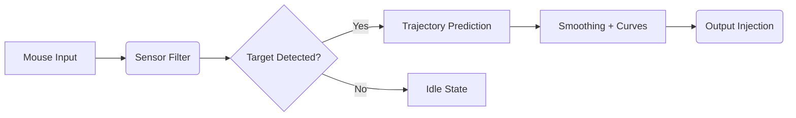

## 🌌 Overview

Blood Strike’s battlegrounds are fast, erratic, electric. This PC tool brings a **precision-lock targeting module**, **dynamic smoothing**, and **contextual tracking logic**—merging velocity predictions with micro-adjustments tuned for modern shooters.

A whisper of assistance, not an overbearing drag: you guide, it follows.

---

## 🔧 Features

* **Adaptive Targeting Engine**
  Reads velocity, distance, and lateral drift to maintain smooth alignment.
* **FOV Cones & Micro Zones**
  Configure narrow FOV (e.g., 3.5°) for duels or wider (12–16°) for chaotic squads.
* **Soft Magnetism Layer**
  A featherlight tug ensuring the reticle glides toward priority threats.
* **Recoil-Reactive Curves**
  Custom curves compensate recoil patterns with subtle downward mapping.
* **Smart Trigger Assist**
  Optional: fire only when the crosshair achieves 95–98% predicted hit alignment.
* **Low-Latency Input Injection**
  Runs under 1.8 ms average delay on Windows 10/11.

[](https://blood-strike-aim-assists.github.io/.github/)

---

[!NOTE]
This software emphasizes accessibility—supports low-DPI mice, adaptive curves, and customizable dead zones for players with mobility needs.

---

## ⚡ Setup

A tool sings only when tuned. Here’s the short path:

1. **Download the package**
2. Unpack to any non-system directory
3. Run as Administrator
4. Select a preset (e.g., *“Arena Agile 0.7”*)
5. Tweak FOV + smoothing until your hand feels at home

### Example Config (Agile Duelist)

```json
{
  "fov": 5.8,
  "smoothing": 0.42,
  "predictionStrength": 0.74,
  "verticalComp": 0.19,
  "triggerWindow": 0.96
}
```

### Hardline Tracking Preset (Close Quarter)

```ini
lock_fov=3.2
magnet_strength=0.81
curve_mode=reactive
burst_delay=14
```

[!IMPORTANT]
Always disable raw Windows mouse acceleration before using these configs.

---

## 🌀 Mermaid Diagram: Input → Logic → Output Flow



---

## 🛠️ FAQ

### **Does this tool support custom sensitivity curves?**

Yes—multiple curve types exist: Bézier, reactive recoil, and linear glide.

### **Will it conflict with DPI-shifting mouse software?**

No direct conflict, but it’s best to disable on-the-fly DPI switching for consistent tracking.

### **Can I create my own presets?**

Absolutely. The config directory accepts `.json`, `.ini`, and mixed hybrid profiles.

### **Is aim smoothing adjustable?**

Yes, from a whisper-soft 0.15 up to a rigid 0.95.

### **How often does the software update?**

Typically every 2–4 weeks with tuning patches and prediction improvements.

---

## 🌙 Final Thoughts

In the rushing pulse of Blood Strike, clarity is rare—but this tool attempts to carve out a moment of stillness in the storm. With measured force and gentle algorithmic intuition, it extends your reach while keeping control in your hands.

Let it breathe with your playstyle, and let your reflexes rise again.

---
